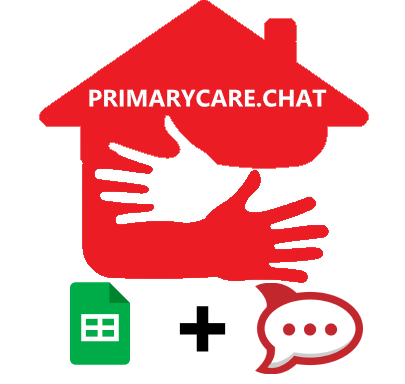
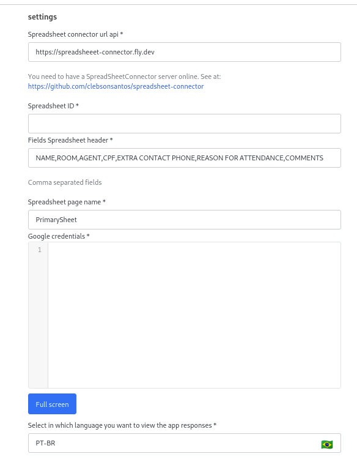

 

# PrimaryCare.Chat App

The PrimaryCare.Chat application is used to record your attendances in digital medical records using the [Google Sheets](https://www.google.com/sheets/about/) as a database.

Tag this project with a star 🌟

## Demonstration
- slash commands
  - /primary-care-medical-record 
  
    https://user-images.githubusercontent.com/60331806/201551918-1275607c-db5d-48ab-a6b7-daac12216454.mp4      

  - /primary-care-find-by-field 

    https://user-images.githubusercontent.com/60331806/201552180-bc9fedde-225f-4c69-a63e-caab4f161d9c.mp4


## Settings

 

## Use

- To use this app you need to have an instance of the [SpreadsheetConnector](https://github.com/clebsonsantos/spreadsheet-connector) online

## Deploy

```bash
rc-apps deploy -v --url https://my-rocketchat.com --username my-username --password 'my-password'

```

## Rocket.Chat documentation
Here are some links to examples and documentation:
- [Rocket.Chat Apps Definitions Documentation](https://rocketchat.github.io/Rocket.Chat.Apps-engine/)
- [Rocket.Chat Apps Definitions Repository](https://github.com/RocketChat/Rocket.Chat.Apps-engine)

